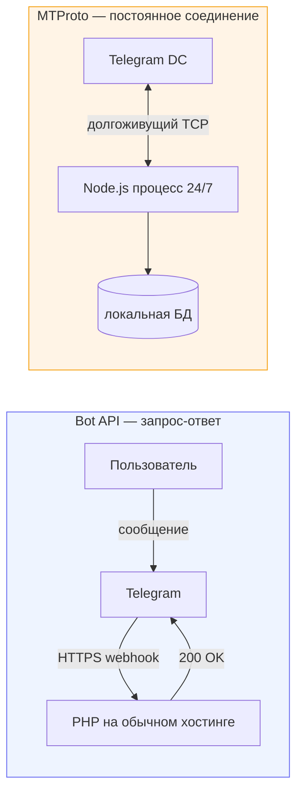
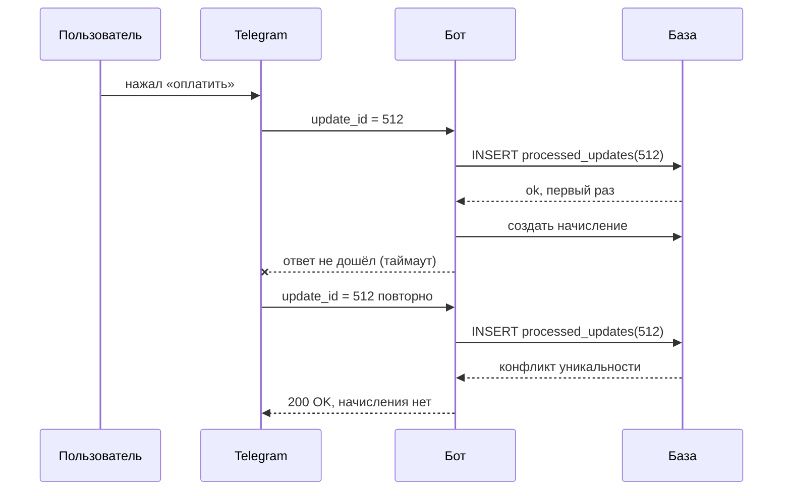
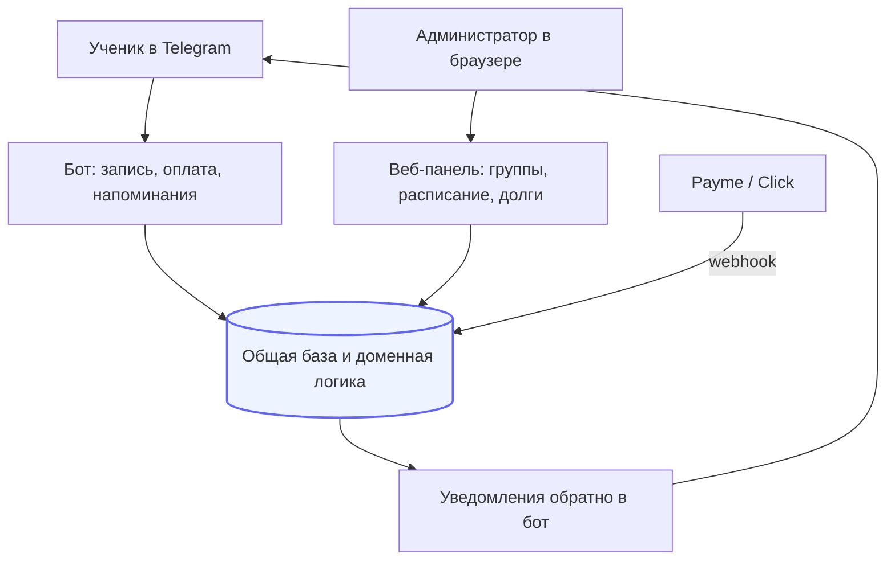

# Архитектура Telegram-систем: Bot API против MTProto

Заметки по двум принципиально разным способам работать с Telegram из бэкенда и по
тому, что ломается при переходе от бота-меню к боту с оплатами и учётом.

Опыт: Telegram-бот с приёмом платежей и веб-панелью (PHP, SQLite) и интеграция
личного аккаунта через MTProto для чтения и отправки в админ-панели (Node.js).

---

## Два разных Telegram

Их постоянно путают, а требования к инфраструктуре у них противоположные.

| | **Bot API** | **MTProto (userbot)** |
|---|---|---|
| Кто вы для Telegram | бот | обычный пользователь |
| Транспорт | HTTPS, webhook или polling | постоянное TCP-соединение |
| Процесс | не нужен, хватает PHP на хостинге | обязателен постоянно живущий процесс |
| Масштабирование | горизонтальное, сколько угодно | **строго один экземпляр на сессию** |
| Видит | только то, что написали боту | всю переписку аккаунта |
| Ломается | таймаутом webhook | обрывом соединения и `AUTH_KEY_DUPLICATED` |



### Практическое следствие для выбора хостинга

Бот на Bot API живёт на любом PHP-хостинге: webhook — это обычный HTTPS-запрос.
Userbot на MTProto **нельзя** развернуть на serverless (Vercel, Netlify,
Cloudflare Workers): там нет постоянного процесса и нет долгоживущих соединений.

И нельзя запускать в двух экземплярах с одной строкой сессии — Telegram выдаст
`AUTH_KEY_DUPLICATED` и сессию придётся восстанавливать входом по коду. Это
исключает автоскейлинг и реплики: ровно один процесс.

---

## Повторная доставка: почему бот начисляет дважды

Telegram повторит апдейт, если бот не ответил вовремя. Пользователь нажал
«оплатить» один раз — обработчик отработал дважды.



Защита — таблица обработанных апдейтов с уникальным индексом по `update_id`.
Именно индекс, а не проверка `SELECT` перед `INSERT`: два одновременных повтора
пройдут проверку оба.

Рядом — ограничение частоты на пользователя: без него один человек, зажавший
кнопку, кладёт обработчик.

---

## Где заканчивается конструктор и начинается разработка

Честная граница, которую стоит проговаривать клиенту до начала работы:

**Собирается без программиста:** меню из кнопок, приветствие, FAQ, форма
«имя-телефон-комментарий» с отправкой в чат.

**Нужен программист:**

- приём оплаты и связь платежа с конкретной услугой или периодом;
- состояние диалога, которое переживает перезапуск (пользователь на третьем шаге
  из пяти, сервер перезапустился — шаг не должен теряться);
- права и роли: ученик, преподаватель, администратор видят разное;
- связь с учётом — остатки, расписание, задолженности;
- рассылка по базе без попадания под флудлимит;
- повторная доставка, гонки, идемпотентность.

---

## Состояние диалога в базе, а не в памяти

Частая ошибка — держать шаг диалога в переменной процесса. Перезапуск, второй
воркер, и пользователь висит в никуда.

```php
// Состояние диалога — строка в БД, привязанная к чату.
// Переживает перезапуск, видно в админке, чинится руками при необходимости.
$session = $sessions->findByChat($chatId) ?? $sessions->start($chatId);

match ($session->step) {
    'await_phone'   => $this->handlePhone($session, $message),
    'await_subject' => $this->handleSubject($session, $message),
    default         => $this->showMainMenu($chatId),
};
```

---

## Связка «бот + панель» вместо бота в одиночку

Бот удобен ученику или покупателю, но администратору в нём работать нельзя:
списки, фильтры, отчёты и массовые операции в чате невозможны.



Ключевое: **бот и панель — два интерфейса к одной доменной логике**, а не две
системы. Начисление задолженности считается в одном месте и одинаково, независимо
от того, кто спросил.

---

## Рассылка: ограничение как часть логики, а не рекомендация

Массовая отправка с личного аккаунта через MTProto — быстрый способ получить
флудлимит и потерять аккаунт вместе со всей перепиской. С ботом мягче, но лимиты
тоже есть.

Практика: суточный лимит зашивается в код и проверяется по журналу отправок,
между сообщениями пауза с разбросом, отправка только в рабочее окно. Не как
настройка, которую можно выкрутить, а как жёсткое ограничение.

---

## Диагностика: почему «сессия жива, но не работает»

Реальный случай, стоивший времени. Клиентская библиотека возвращала
«не авторизован», хотя сохранённая сессия была в порядке.

Причина: библиотека **проглатывает все ошибки внутри** проверки авторизации и
возвращает `false` без исключения. Соединение умерло после многодневного простоя,
а наружу это выглядело как «войдите заново».

Лечение — не доверять одиночному `false`: сбросить закэшированный клиент,
переподключиться и перепроверить на свежем соединении. После этого «мёртвая»
сессия оживает без повторного входа по коду.

---

## Смежные заметки

- [db-schema-notes](https://github.com/Shohruh1997/db-schema-notes) — схемы, включая `tg_chats` и составной ключ
- [payment-integration-notes](https://github.com/Shohruh1997/payment-integration-notes) — приём оплат из бота
- [php-layered-architecture-notes](https://github.com/Shohruh1997/php-layered-architecture-notes) — общая логика для бота и панели

---

Шохрух Рузиев · backend-разработчик, Ташкент · [ecomdev.uz](https://ecomdev.uz)
